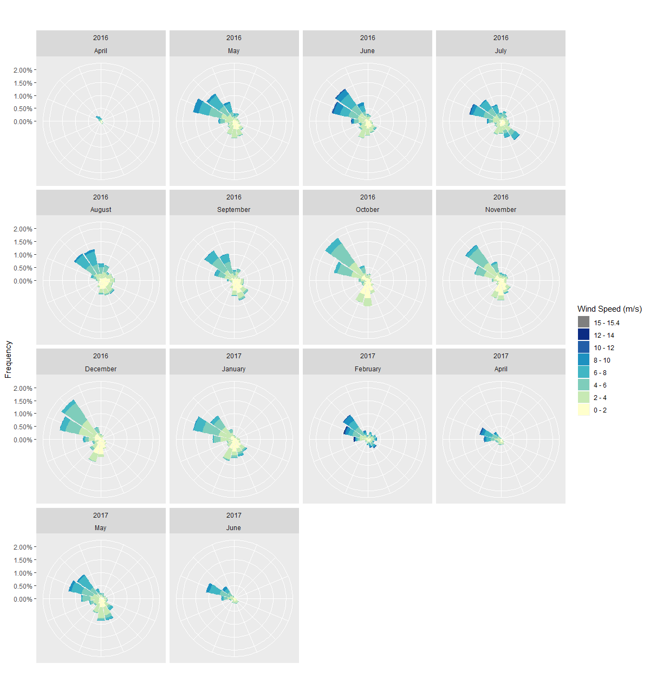

# Create a windrose in R

The code in this repository is based on the solution by user Andy Clifton in [this](https://stackoverflow.com/questions/17266780/wind-rose-with-ggplot-r) stack overflow thread.

Example output:

